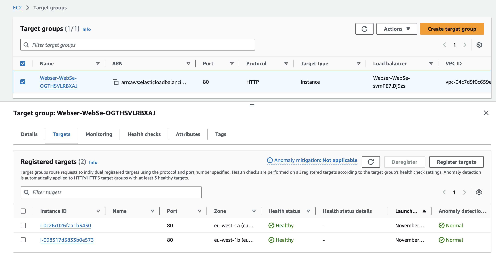

# Infrastructure as Code (IaC) for AWS Two-Tier Architecture in corporation with GitHub Actions

## About this repo

This repo contains a MVP setup in form of Infrastructure as Code (IaC) for deploying a two-tier architecture on AWS (i.e. Database layer and Web Application layer).

The setup uses AWS CloudFormation for developing and maintaining resource templates. The templates are stored in this GitHub repo and deployed to AWS via GitHub Actions pipeline through the created Workflow automation. The focus is to keep the architecture scalable, fault-tolerant, and highly available while also maintaining a security standard and modular enough for developers to scale different AWS resources (i.e. VPC, IAM, Webserver, Database) independently.

> **NOTE**: The templates are built to utilize AWS free tier resources for the time being and can be adjusted based on the usage.

## Design Overview

*Architecture Design*: 

This project uses a two-tier architecture deployed on AWS, with an automated CI/CD pipeline for easy deployment via GitHub Actions pipeline. The code is stored in GitHub. The architecture consists of following components:

### GitHub Components

- **GitHub Repository**:
  - The repo houses the Infrastructure as Code (IaC) for deploying the AWS resources.
  - When the changes to the CloudFormation templates are merged into the `main` branch, it triggers GitHub Actions pipeline.

- **GitHub Actions**:
  - This helps to automates the deployment process by triggering a workflow whenever CloudFormation template changes are merged to `main` branch.
  - The pipeline uses the AWS CLI to deploy the CloudFormation template to AWS.
  - The AWS Access Credentials are stored in GitHub Secrets and retrieved by the Workflow.

    *GitHub Actions Pipeline snippet*:

### AWS Infrastructure Components

- **VPC**:
  - This is our private cloud in AWS environment and can be configured to setup the network environment and control traffic to the AWS resources under this VPC.
  
    *VPC snippet*: 

- **AWS CloudFormation**:
  - It deploys the infrastructure as defined in the template.
  - CFN template changes help manage creation, updates, and deletions of resources based on that stack.
  
    *Cloudformation snippet:* 

- **Public Subnet**:
  - Hosts EC2 instances (web servers) across 2 availability zones.
  - Each web server is assigned a security group that restricts access to only required HTTP(S) traffic.

- **Private Subnet**:
  - Hosts an Amazon RDS instance (MySQL) that is not publicly accessible and has traffic allowed from the Webserver.
  - The database is set up with a Multi-AZ configuration.

- **Internet Gateway**:
  - This is to provide access to the resources in the public subnet to the internet. Once its connected with the internet, users can hit this server.
  
    *Internet Gateway snippet:* 

- **Target Group**:
  - This is to group the Webserver instances which are revved up by the Autoscaling group.
  - This target group is assigned to the Load balancer for it to divert traffic based on server traffic load.
  
    *Target group snippet:* 

- **Autoscaling Group**:
  - This is to make sure that the Webserver instances can be horizontally scaled depending on the load on the EC2 instances.
  - The EC2 AMI used for the launch template for the Webserver is based on Free tier Amazon Linux 2023 with installed MySQL, SSM, and Apache HTTP server (Custom AMI created via the image).
  - The revved up instances are grouped under the target group.
  
    *Auto Scaling group snippet:*: 

    *EC2s part of ASG snippet:*: 

- **Application Load Balancer**:
  - This is to distributes incoming traffic across the Webserver fleet in the public subnets.
  - A Listener is setup to receive traffic for the load balancer.
  
    *Load Balancer snippet:*: 

- **Security Groups**:
  - These are implemented to Control the traffic allowed to the web servers and RDS instance.

- **RDS Instance**:
  - The RDS instance is deployed in the private subnet and will act as our database layer. It is deployed for MySQL DB in our case.
  
    *RDS Instance snippet*: 

    *RDS instance login from Webserver*: 

### Communication between GitHub and AWS

- The GitHub is communicating with AWS via AWS CLI using the AWS Access Credentials stored in GitHub Secrets of the repo.
- The deployment workflow looks like:
  - **Template update in GitHub repo** > **GitHub Actions Workflow Triggered** > **AWS CloudFormation Deployment** > **Resources Created/Updated/Deleted in AWS**.

This setup provides a robust, scalable, and secure environment that is automatically deployed through GitHub Actions!

Source references:

- [two-tier architecture design](https://achinthabandaranaike.medium.com/how-to-deploy-a-two-tier-architecture-in-aws-using-terraform-a4fd0f2e19ae)

- [GitHub Actions documentation](https://docs.github.com/en/actions/writing-workflows)

## Considerations for this design

The architecture is designed to consider following aspects:

- **Scalability**
  - Using an Auto Scaling Group to scale number of EC2 instances in the application layer to automatically rev up new instance and assigned to the target group in case of server load. (In our case, minimum 2 instances, max 4 instances)

- **High Availability**
  - Using an Application Load Balancer to distribute traffic across the EC2 instances in the target group to have balanced load across the fleet.

- **Fault Tolerance**
  - Resources are deployed in multiple availability zones (2 AZs) in case there is an issue with one of the AZs.
  - The RDS is setup with Multiple AZs. This is done to make sure if in the event of a failure, RDS should automatically failover to the standby instance in the secondary AZ.

- **Security**
  - The credentials are stored securely under AWS Secrets Manager and Github Security and not exposed publically.
  - The RDS is deployed in Private subnet and only has traffic allowed from the Webserver.
  - The NAT Gateway setup has also been provided in the VPC_stack.yaml template (currently commented) in case private resources need to access internet.

## How to setup?

To setup the architecture, follow the steps below:

- Clone the repository through command below:

    ```
    git clone https://github.com/takshilbharadwaj/IaC_based_on_AWS_for_building_two-tier_architecture.git
    ```

- Review and customize the CloudFormation templates or add new templates based for the requirements. Currently, following stacks are deployed (for modularity):
  - VPC network stack: (`vpc_stack.yaml`) This holds the VPC configuration, Internet gateway, Public Subnet, NAT gateway (currently commented as it incurs cost), and private Subnet setup.
  - IAM stack: (`IAM_stack.yaml`) This holds the IAM related resources. For now, a single IAM role with access to SSM and Secrets manager is created.
  - Webserver stack: (`webserver_stack.yaml`) This contains the Webserver related resource deployments, like Load balancer, target group, LB Listener, Autoscaling group, Security groups for Webserver and Load balancer, EC2 launch profile configuration, etc.
  - Database stack: (`db_stack.yaml`) This contains the deployment of RDS instance and setting it up in the Private subnet, currently only allowing traffic from Webserver.
- Update secrets:
  - Add the AWS Access credentials to GitHub Secrets with keys `AWS_ACCESS_KEY_ID` and `AWS_SECRET_ACCESS_KEY`.
  - Add the RDS instance Master username and password with keys `username` and `password` in AWS Secrets Manager in the same region. Currently the repo looks for secret name `RDS-Master-Creds` in the Secrets manager, so store the creds accordingly.
- If needed, update the `workflow.yml` accordingly to accommodate new templates.
- Push changes to the `main` branch, and let the GitHub Actions deploy the CFN templates!

- To test your Webserver, hit the Loadbalancer DNS on the browser
    
    *Webserver running snippet*: 

## Future Improvements

Since this is a MVP setup, certain aspects can be improved in the architecture depending on the maturity of the project.

- **Monitoring, Logging and alerting**:
  - Integrate AWS CloudWatch for performance monitoring and logging the calls made to the Webserver.
  - Implement monitoring and logging for RDS to keep an eye on it.
  - Setup alerts, probably by using SNS topics/CloudWatch to setup alerts depending on the use-case.

- **Increase Security standards**:
  - Adding stricter security group rules will help to control the traffic better as well as keep the system more secure. Also, consider adding Web Application Firewall (WAF) for additional protection, for e.g. Rate limit maybe required to avoid attacks like DDoS.
  - Try tightening the IAM roles to follow "Least privilege principle".

- **Automated Testing**:
  - Implement automated checks in GitHub Actions to validate infrastructure configurations before deployment.

- **Change Set preview prior deploy**:
  - Currently, whatever template is pushed, the AWS CLI will try to deploy those changes. To avoid this, it maybe good idea to update the workflow in a way to first plan the deployment and then if the change set is valid, only then go for further deploy.

- **Workflow update**:
  - Currently, the workflow performs deploy for all the templates even if one template is updated. IMO, this is OK for MVP, but ideally only the template which was updated should be triggered for deployment.
  